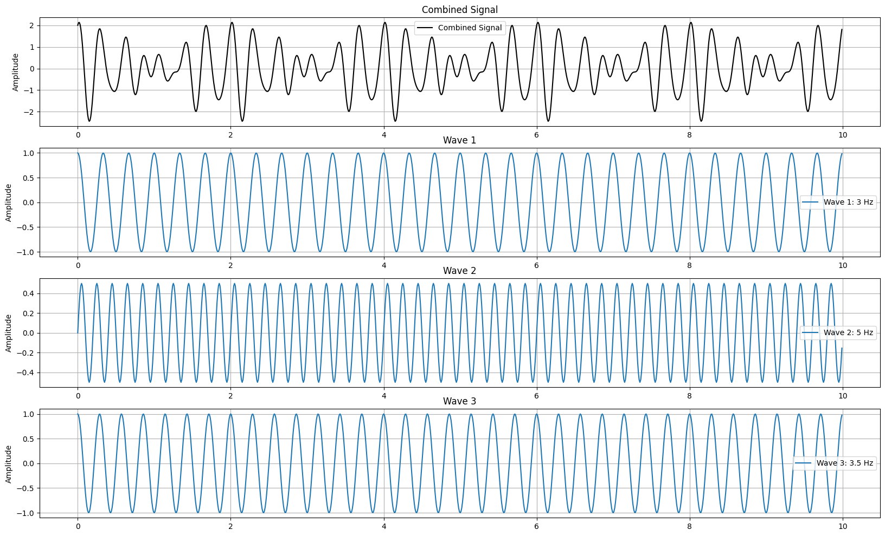
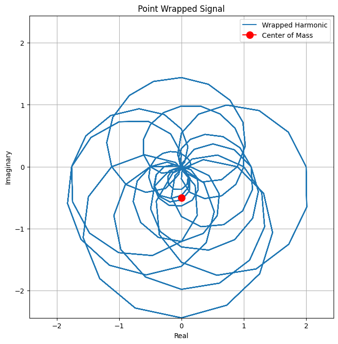
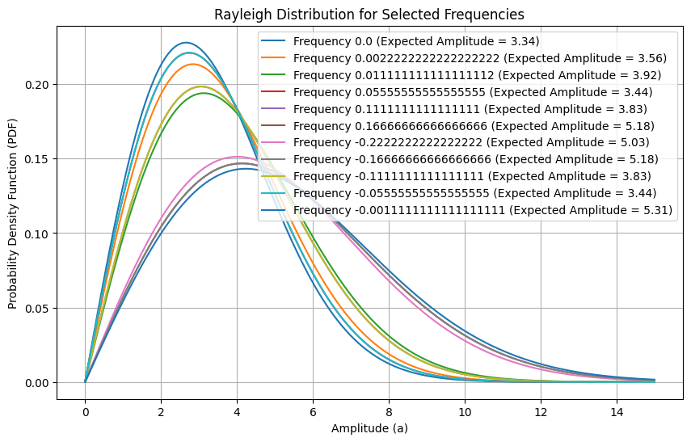

# Sharing Concepts Encountered during PhD Journey
_Concepts should fall within the intersection of mathematics, oceanographics, and machine learning_

## Info
This repository contains essential concepts used during my PhD journey at the University of Western Australia (UWA).
These concepts will include simple examples of me understanding the concept, through to more advanced examples/ links to other code sources containing more advanced examples that I encounter.

## Topics
### Fourier Series
The [Fourier Transform for Ocean Waves](resources/fourier_for_ocean_waves.ipynb) details the idea of the fourier transform, how to code its mathematics, and how it relates to the phase and amplitude spectrum if the signal is interpretted as a buoy. The notebook is based on the amazing Youtube series by 3Blue1Brown. Link [here](https://youtu.be/spUNpyF58BY). 

Interesting figures from the Notebook:

| Simulated Wave | Wrapped-harmonic signal with $f=5$ |
|----------------|-------------------------|
| |  |

### Random-Phase/Amplitude Model
The [Random-Phase/Amplitude Model](notebooks/random_phase_amplitude_model.ipynb) details the process of transforming surface elevation into the random-phase/amplitude model representing sea state. Specifically, the use of statistical distributions to create realizations of wave simulations. 
This notebook is based on the information contained in *Waves in Oceanic and Coastal Waters by Leo H. Holthuijsen* (Chapter 3)

| Statistical Wave Distributions | ... |
|----------------|-------------------------|
|  | |

#TODO Extend this notebook into the 2-Dimensional random-phase/amplitude spectrum.

### Inverse Problem
TODO Document the Notebook

### Engineering Math
#TODO Documentation for Probabilistic weather model
#TODO Documentation for Taylor series expansion of sin(x)

## Virtual Environment and Kernel
1. Create a venv virtual environment `python -m venv .venv`
2. Activate environment `source venv/bin/activate`
3. Install requirements `pip install -r requirements.txt`
4. Install ipykernel `pip install ipykernel`
5. Create a Jupyter kernel `python -m ipykernel install --user --name={NAME}` replacing `{NAME}` with a kernel name

## Disclaimer
These notes are my personal notes and understanding based on my interpretation of the concepts explained in the various sources. All credit for the original content goes to the various authors/ creators. This repository of notes is used for educational purposes only (non-commercial). Please refer to each of the references sources for the full and accurate content in each.